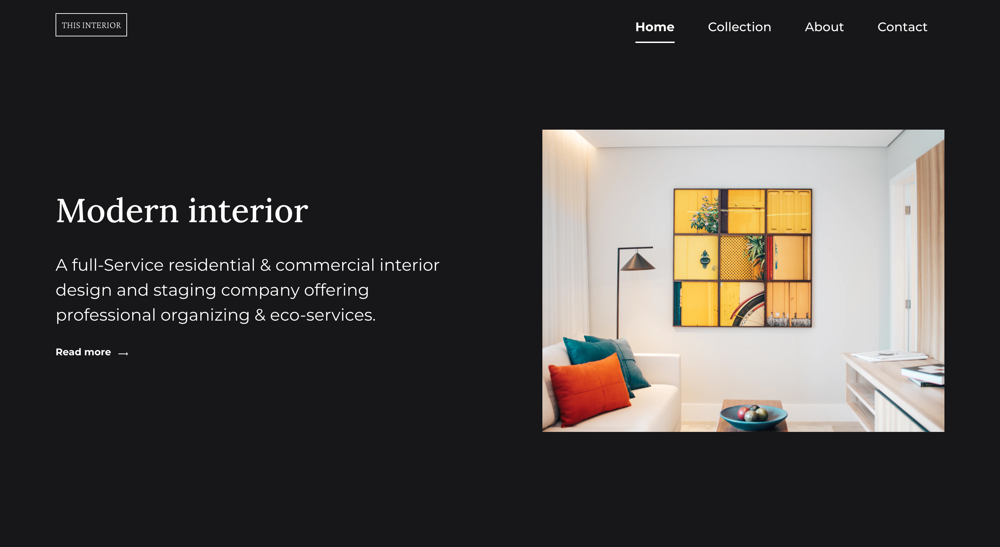

<h1 align="center">Interior Design Consultant</h1>

   Solution for a challenge from  <a href="http://devchallenges.io" target="_blank">Devchallenges.io</a>.

  <h3>
    <a href="https://rb-interior-consultant.netlify.app/">
      Demo
    </a>
     | 
    <a href="https://github.com/ritabradley/interior-consultant">
      Solution
    </a>
     | 
    <a href="https://devchallenges.io/challenges/Jymh2b2FyebRTUljkNcb">
      Challenge
    </a>
  </h3>

<!-- TABLE OF CONTENTS -->

## Table of Contents

- [Overview](#overview)
- [Features](#features)
- [Contact](#contact)

<!-- OVERVIEW -->

## Overview

### How I approached this challenge

If you want to see a demo of my solution, you can find it [here](https://rb-interior-consultant.netlify.app/).

It took about a 6 hours in total to complete this project with the mobile navigation taking the longest to complete. The
main reason the mobile navigation took so long was because I coded it from scratch with pure CSS and no javaScript. I
used the `:checked` pseudo-class to toggle the menu open and closed.

I used flexbox to position the elements on the page and used floats for part of the navigation. I used the `:before` and
`:after` pseudo-classes to create the lines on the navigation. There's a slight animation when opening and closing the
menu to make it a less jarring experience. I feel like this project has helped me get a better grasp of how to use CSS
for things I would normally use JavaScript for. It's also given me the opportunity to practice more CSS in general. I
hope to before more comfortable with vanilla CSS over time and become less reliant on frameworks like Bootstrap or
TailwindCSS.

## Features

This application/site was created as a submission to a [DevChallenges](https://devchallenges.io/challenges) challenge.
The [challenge](https://devchallenges.io/challenges/Jymh2b2FyebRTUljkNcb) was to build an application to complete the
given user stories.

## Contact

- Website [ritabradley.dev](https://ritabradley.dev)
- GitHub [@ritabradley](https://github.com/ritabradley)
- Twitter [@ritabradley_dev](https://twitter.com/ritabradley_dev)
